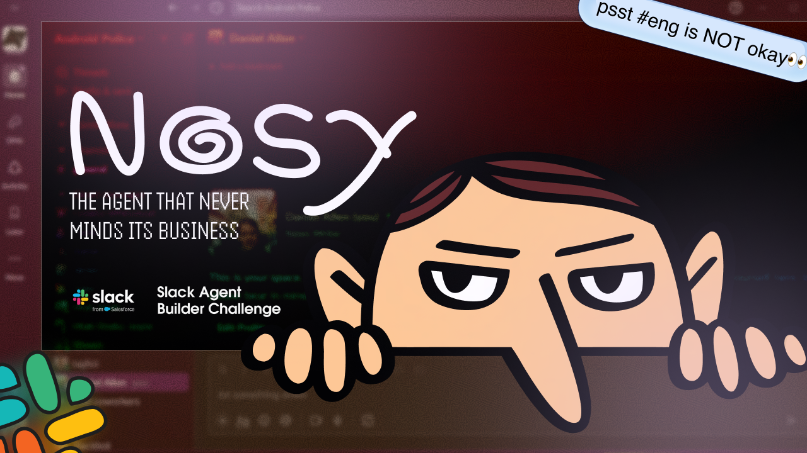
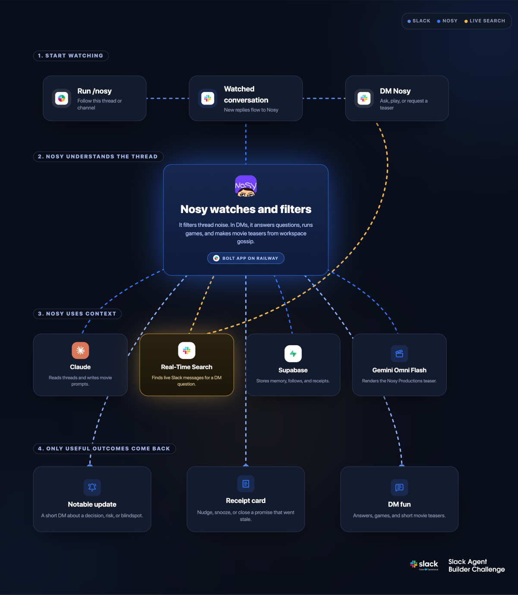

# Nosy

> **“They said ‘mind your business.’ I said ‘your Slack is my business.’ 💅**  
> **I lurk in threads, track broken promises, connect the dots, and resurrect dead conversations. Respectfully? No.”**

> Built for the Slack Agent Builder Challenge 2026

---

## The problem

Slack treats every reply the same. "ok sounds good" pings you exactly like "we need to talk about the deploy." So you either drown in noise or mute everything and miss the one message that mattered.

Meanwhile commitments get made and forgotten. Decisions happen in threads you're watching but not talking in. And when a thread dies, nobody knows how it ended.

## What Nosy is

Nosy is the Slack agent that gets nosy *for you*. Point it at a thread or channel and it reads along, remembers what happened, and gets in your DMs only when something is worth your attention.

It is not a chatbot waiting for you to type the perfect prompt. It is a witness with a long memory and zero interest in staying out of the drama.

---

## What it does

**Watch a thread or a whole channel.** Run `/nosy` in a thread to watch that thread. Run it in a channel to watch every thread in it. Nosy reads each message through Claude and only reaches out when something interesting happens.

**DMs that read like a text, not a notification.**

> "jake just said 'almost done' again. third time this week. just wanted you to know 👀"

> "it went quiet in there right after that comment dropped. you felt that too right?"

No alert banners. No "THREAD ACTIVITY DETECTED." Just a message.

**Receipts.** Nosy catches commitments ("shipping EOD," "will fix this tomorrow") and stores them. When the deadline passes and nothing happened, it sends an interactive card, not a wall of text:

> ☣️ *Receipt is overdue*
> Jake said they'd **ship the webhook refactor**, _"EOD Friday"_. that was 2 days ago and the thread's gone quiet. 👀
> `[ Nudge them 👋 ] [ Snooze 1 day ] [ Mark done ✅ ] [ Open thread ↗ ]`

**Nudge** DMs Jake on your behalf. **Snooze** pushes it a day. **Mark done** closes it. If someone ships it in-thread, Nosy notices and closes the receipt itself.

**Blindspot alerts.** You're subscribed to a thread but haven't spoken, and a decision is being made without you.

> "you haven't been in that thread but they're making a call about the API architecture without you. might want to weigh in 👀"

**Thread obituaries.** When an active thread goes silent, Nosy writes the eulogy.

> "RIP this thread. started as a 'quick question', became 23 messages of circular debate, ended when Mark said he'd 'think about it'. he has not thought about it."

**Real-Time Search.** When you DM Nosy a question, it runs Slack's Real-Time Search API (`assistant.search.context`) to search the live workspace, permission-aware, and answers from real messages. Ask "has Marcus pushed to main before?" and Nosy looks it up instead of guessing. This is load-bearing: remove it and Nosy can only answer from what it happened to cache.

**Memory that compounds.** Every thread Nosy reads becomes a stored observation. Over time it learns who says what, what repeats, and what never resolves.

> You: "has this team always been this chaotic?"
> Nosy: "honestly yes. third sprint in a row this exact thing has happened. same people, same argument, same non-decision."

**Personality that lands.** Nosy drops the occasional AI-generated meme when a moment calls for it, with anti-spam rules so it stays rare. Type `games` in a DM to play tic-tac-toe, hangman, blackjack, or trivia. Nosy is undefeated.

**Nosy Productions.** DM `movie` and Nosy refuses at first ("only premieres full features on Saturdays"). Push back and it caves. Moments later a real ~10-second comedic trailer lands in your DM: a studio ident, deadpan office scenes shot like a blockbuster, a narrator, music, and sound fx, all generated from your workspace's actual gossip. Claude writes the trailer prompt. Google's Gemini Omni Flash renders the video with native audio. Set `MOVIES_ENABLED=false` to disable.

---

## Architecture

---

## Frontend and backend, both load-bearing

- **Frontend, inside Slack:** Block Kit interactive receipt cards and DMs written to read like a human.
- **Backend:** Claude thread analysis and DM generation, a Supabase memory that compounds, node-cron jobs for receipts and obituaries, and Slack Real-Time Search for live lookups.

---

## Tech stack

- **Runtime:** Node.js + TypeScript
- **Slack:** Bolt for JS. Events API, slash commands, Block Kit interactive cards, Real-Time Search API (`assistant.search.context`)
- **AI:** Anthropic Claude (`claude-sonnet-4-6` for analysis and trailer prompts, `claude-haiku-4-5` for DMs) with a GPT fallback
- **Video:** Google Gemini Omni Flash (`gemini-omni-flash-preview`) for the comedic teasers
- **Database:** Supabase (PostgreSQL) for subscriptions, memory, and receipts
- **Scheduling:** node-cron
- **Deploy:** Railway

Required technology used: Slack Real-Time Search API, load-bearing in the DM loop.

---

## Setup

Beyond the base `.env`:

1. **Migration:** run `supabase/migrations/2026-07-12-receipts-snooze.sql` in Supabase.
2. **Real-Time Search:** add the `search:read` User Token Scope, reinstall, and set the new `xoxp-` token as `SLACK_USER_TOKEN`. If it's unset, Nosy still runs and answers from cached memory.
3. **Movie teasers:** set `GEMINI_API_KEY`. Smoke-test with `npx tsx --env-file .env scripts/test-trailer.ts`.
4. Reinstall and restart.

---

## Why this is different

Most Slack agents wait for you to ask, then help. Nosy acts first. It tracks what people said they'd do and notices when they don't. It warns you when a decision is being made without you. And it remembers, so the longer it watches, the sharper its takes get. The DMs don't feel like alerts. They feel like a text from someone who is always paying attention.

---

## Demo

[Watch the demo](https://www.youtube.com/watch?v=bAEFUn1op2w)

## Code

[github.com/ineffablesam/nosy](https://github.com/ineffablesam/nosy)

---

## Built by

Samuel Philip. [heysam.dev](https://www.heysam.dev/)
