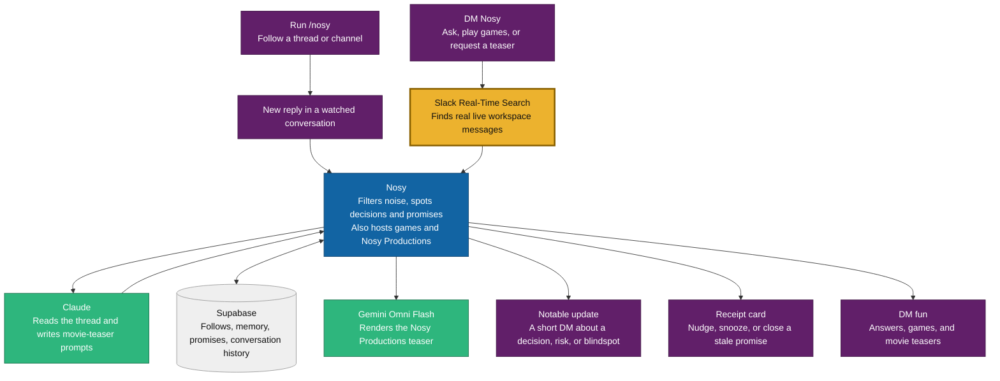

# Nosy Architecture

Nosy watches a Slack conversation for you, filters routine noise, and reaches out only when a decision, risk, promise, or direct question deserves your attention. In DMs, it also runs a game room and makes short Nosy Productions teasers from workspace gossip.

Gold traces the path Nosy uses to look up live Slack messages when someone asks a question. Open `architecture.html` in a browser and screenshot it for the Devpost architecture upload.
